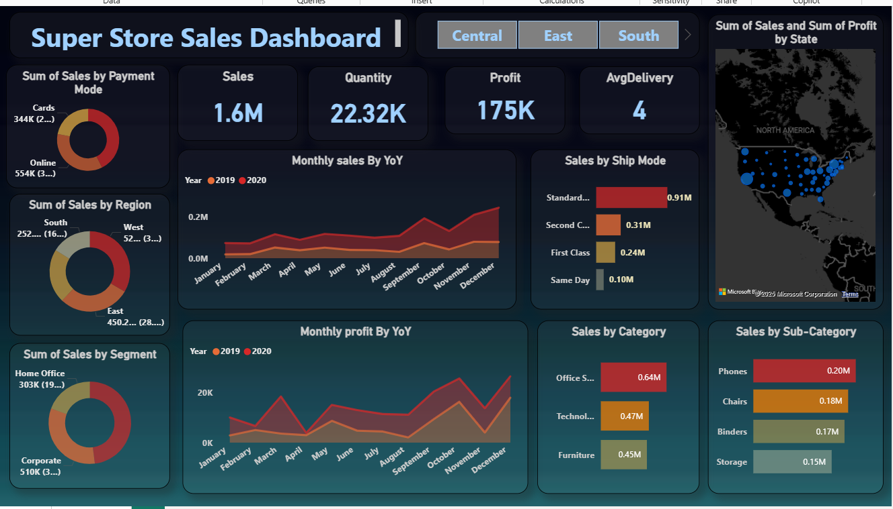
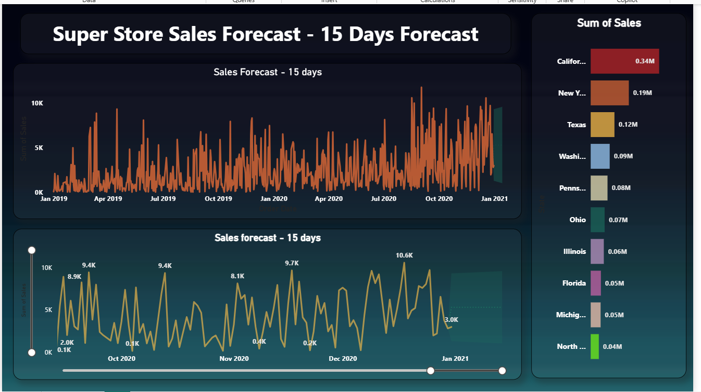

# 📊 Superstore Sales & Forecast Dashboard – Power BI Project

This Power BI project presents a complete **Sales Overview and 15-Day Sales Forecast** for a Superstore dataset. It combines powerful visuals, insightful KPIs, and forecasting techniques to support business decision-making in retail operations.

---

## 📁 Project Files

- `superStore_sale.pbix` – Power BI dashboard (Overview and Forecaste)
- `SuperStore_Sales_Dataset.csv` – Dataset for Dashboard
- `SuperStore Sales DataSet.xlsx` – Excel file for Dataset
- `sales-overview.png` – Sales Analysis Dashboard screenshot
- `sales-forecast.png` – Forecast Dashboard screenshot

---

## 🖼️ Dashboard Preview

### 🔹 Sales Overview Dashboard  

### 🔹 15-Day Sales Forecast Dashboard  

---

## 📋 Dashboard Pages

### 1️⃣ **Sales Analysis Dashboard**

This page highlights performance trends, segment insights, product-level contributions, and regional breakdowns.

🔹 **KPIs:**
- 💰 Sales: **1.6M**
- 📦 Quantity Sold: **22.32K**
- 💹 Profit: **175K**
- 🚚 Avg. Delivery Days: **4**

🔹 **Visuals:**
- Sales & Profit (YoY Trend)
- Sales by Region, Segment, and Payment Mode
- Top Categories and Sub-Categories (e.g., Phones, Chairs)
- Shipping Mode Breakdown (Standard, Second Class, etc.)
- Sales & Profit by State (Map Visual)

---

### 2️⃣ **Sales Forecast Dashboard – 15 Days**

This page uses time series forecasting to visualize short-term sales trends and identify demand spikes.

🔮 **Visuals:**
- Sales Forecast Line Chart (15-day projection)
- Zoomable Date Slicer with trend navigation
- Historical vs Projected Trend View
- Top 10 States by Sales Volume (e.g., California, New York, Texas)

---

## 📈 Key Business Insights

- 🏆 **California** dominates sales, followed by NY and Texas.
- 🚚 **Standard shipping** is the most used mode.
- 📦 **Phones & Chairs** are top-performing sub-categories.
- 📊 Forecast reveals **spikes near holidays and month-end** periods.
- 📍 South and East regions lead in revenue generation.

---

## 🛠️ Tools Used

| Tool        | Purpose                             |
|-------------|-------------------------------------|
| Power BI    | Data Modeling & Interactive Visuals |
| Power Query | Data Cleaning & Transformation      |
| DAX         | Custom Measures and KPIs            |
| Time Series Forecasting | Built-in analytics model |

---

## 🧪 How to Use

1. Open `superStore_sale_combined.pbix` in Power BI Desktop.
2. Navigate between the **Sales Dashboard** and **Forecast Dashboard** using tabs.
3. Use slicers and filters to explore product, region, and time-specific trends.
4. Review KPIs and charts for actionable insights.

---

## 📬 Contact

**Chanchal Mahour**  
🔗 [LinkedIn](https://www.linkedin.com/in/chanchalmahor/)  
📧 chanchal01232@gmail.com 

---

> ⭐ *Star this repo if you find it helpful and share your feedback!*

